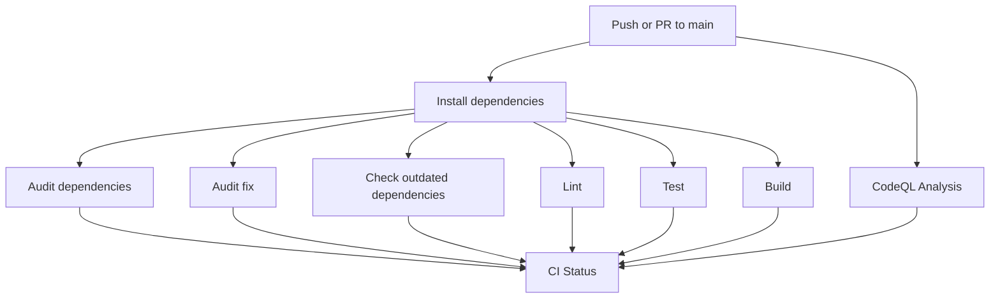
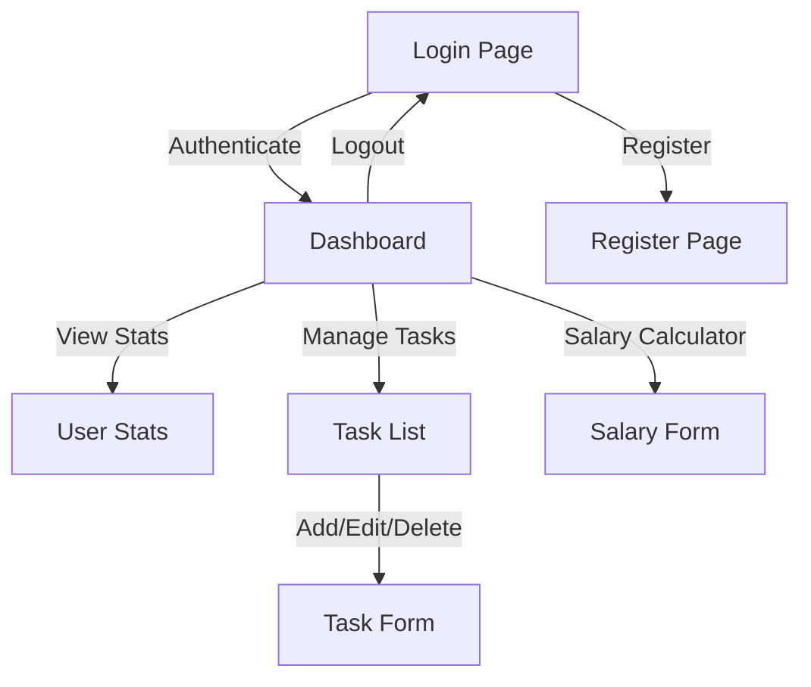

## CI/CD Workflow Diagram


## Application Flow Diagram



# LoginApp

LoginApp is a modern Angular application featuring authentication, dashboard, task management, salary calculator, and user statistics. It uses Angular Material for UI, RxJS for reactivity, and includes robust testing, linting, and CI/CD integration.

## Features

- User authentication (login)
- Dashboard with user stats
- Task management (add, edit, delete, complete)
- Salary breakdown calculator
- Responsive UI with Angular Material
- ESLint and Prettier for code quality
- GitHub Actions for CI/CD, security, and dependency checks

## Project Structure

- `src/app/` — Main application code
- `src/app/features/` — Feature modules (auth, task, salary, etc.)
- `src/app/core/services/` — Core services (auth, task, etc.)
- `src/app/shared/` — Shared components and pipes

## Prerequisites

- Node.js v20+
- npm v9+
- Angular CLI v20+

## Setup

Install dependencies:

```bash
npm ci
```

## Development server

To start a local development server, run:

```bash
npm start
```

Open your browser at [http://localhost:4200](http://localhost:4200).

## Building

To build the project:

```bash
npm run build
```

## Testing

Run unit tests:

```bash
npm test
```

## Linting

Run ESLint checks:

```bash
npm run lint
```

Auto-fix lint issues:

```bash
npx eslint . --fix
```

## Security & Dependency Checks

Audit for vulnerabilities:

```bash
npm run audit
```

Auto-fix vulnerabilities:

```bash
npm run audit:fix
```

Check for outdated dependencies:

```bash
npm run check-updates
```

## Continuous Integration

This project uses GitHub Actions for CI/CD:
- `.github/workflows/angular-ci.yml` — Lint, test, build, audit, and check updates (parallel jobs)
- `.github/workflows/codeql.yml` — CodeQL security/code analysis

## Code Scaffolding

Generate a new component:

```bash
ng generate component component-name
```

For more schematics:

```bash
ng generate --help
```

## Additional Resources

- [Angular CLI Overview and Command Reference](https://angular.dev/tools/cli)
- [Angular Material](https://material.angular.io/)
- [ESLint for Angular](https://github.com/angular-eslint/angular-eslint)
- [GitHub Actions](https://docs.github.com/en/actions)

